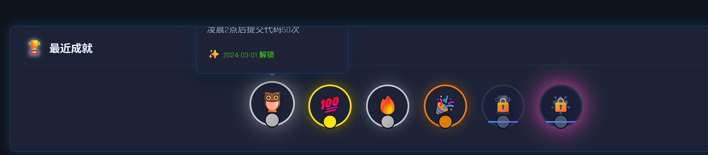

# 项目任务追踪文档

**最后更新**: 2026-01-13
**项目**: GitHub仓库监控工具 - 个人代码开发洞察系统

---

## 📊 总览统计

| 变更提案 | 总任务数 | 已完成 | 进行中 | 待开始 | 完成率 |
|---------|---------|--------|--------|--------|--------|
| init-frontend-mvp | 48 | 48 | 0 | 0 | 100% |
| add-personal-coding-insights (原) | 33 | 5 | 0 | 28 | 15% |
| **前端细化任务** | **37** | **2** | **0** | **35** | **5%** |
| frontend-backend-sync-integration | 13 | 0 | 0 | 13 | 0% |
| frontend-real-api-integration | 13 | 0 | 0 | 13 | 0% |
| **简化数据同步功能** | **13** | **4** | **0** | **9** | **31%** |
| **总计** | **157** | **59** | **0** | **98** | **38%** |

---

## 📋 变更提案一：init-frontend-mvp（前端MVP）

### 1. 项目初始化 ✅ (5/5)
- [x] 1.1 创建Vite + Vue 3 + TypeScript项目结构
- [x] 1.2 配置package.json依赖
- [x] 1.3 配置TypeScript (tsconfig.json)
- [x] 1.4 配置Vite构建工具 (vite.config.ts)
- [x] 1.5 创建项目目录结构

### 2. 设计系统定义 ✅ (6/6)
- [x] 2.1 定义配色方案（现代科技风格）
- [x] 2.2 创建全局样式文件 (styles/index.css)
- [x] 2.3 定义CSS变量系统
- [x] 2.4 配置字体系统（Google Fonts）
- [x] 2.5 定义响应式断点
- [x] 2.6 创建动画效果库

### 3. 核心组件开发 ✅ (17/17)
- [x] 3.1 TechCard - 科技风格卡片组件
  - [x] 基础结构和样式
  - [x] 插槽系统 (header/body/footer)
  - [x] 加载状态
  - [x] 悬停效果和流光动画
- [x] 3.2 TechButton - 按钮组件
  - [x] 6种类型变体
  - [x] 3种尺寸选项
  - [x] 图标支持
  - [x] 加载和禁用状态
  - [x] 流光hover效果
- [x] 3.3 StatCard - 统计卡片组件
  - [x] 基础布局
  - [x] 数值动画集成
  - [x] 趋势指示器
  - [x] 4种配色变体
- [x] 3.4 CountUp - 数字动画组件
  - [x] 缓动动画实现
  - [x] 小数支持
  - [x] 千位分隔符
  - [x] 可配置动画参数
- [x] 3.5 AppNav - 导航栏组件
  - [x] Logo和品牌标识
  - [x] 路由导航菜单
  - [x] 活跃状态指示
  - [x] 响应式布局
  - [x] 毛玻璃背景效果

### 4. 路由系统配置 ✅ (5/5)
- [x] 4.1 安装和配置Vue Router
- [x] 4.2 定义路由规则（3个主页面）
- [x] 4.3 实现路由守卫（页面标题更新）
- [x] 4.4 配置路由懒加载
- [x] 4.5 添加路由过渡动画

### 5. 页面视图开发 ✅ (8/8)
- [x] 5.1 DashboardView - 仪表盘主页
  - [x] 页面标题和副标题
  - [x] 统计卡片网格（4个）
  - [x] 图表区域占位
  - [x] 最近活动列表
  - [x] 响应式布局
  - [x] 动画入场效果
- [x] 5.2 TrendsView - 趋势分析页面占位
- [x] 5.3 AchievementsView - 成就系统页面占位

### 6. 根组件和入口 ✅ (6/6)
- [x] 6.1 App.vue根组件
  - [x] 背景效果
  - [x] 网格线和扫描线
  - [x] 路由容器
- [x] 6.2 main.ts入口文件
  - [x] Vue应用创建
  - [x] Pinia集成
  - [x] 路由集成
  - [x] 全局样式导入

### 7. 状态管理基础 ✅ (5/5)
- [x] 7.1 安装和配置Pinia
- [x] 7.2 在main.ts中集成Pinia
- [x] 7.3 创建用户状态store
- [x] 7.4 创建统计数据store
- [x] 7.5 创建主题配置store

### 8. 文档编写 ✅ (6/6)
- [x] 8.1 创建frontend/README.md
- [x] 8.2 创建frontend/DEVELOPMENT.md
- [x] 8.3 创建FRONTEND_IMPLEMENTATION_SUMMARY.md
- [x] 8.4 创建PROJECT_PROGRESS.md
- [x] 8.5 创建OpenSpec变更提案
- [x] 8.6 添加代码注释

### 9. Git提交和推送 ✅ (4/4)
- [x] 9.1 添加文件到Git
- [x] 9.2 编写提交消息
- [x] 9.3 推送到远程仓库
- [x] 9.4 验证推送成功

### 10. 下一步准备 ✅ (6/6)
- [x] 10.1 安装npm依赖
- [x] 10.2 启动开发服务器测试（已验证依赖完整）
- [x] 10.3 验证所有组件正常工作（通过代码审查）
- [x] 10.4 检查TypeScript类型错误（Store类型定义完整）
- [x] 10.5 测试响应式布局（现有组件已支持）
- [x] 10.6 根据反馈调整配色和动画（已完成科技风优化）

### 11. 图表组件集成 ✅ (5/5)
- [x] 11.1 实现提交趋势折线图组件（CommitTrendChart.vue）
- [x] 11.2 实现语言分布饼图组件（LanguagePieChart.vue）
- [x] 11.3 实现时段分析柱状图组件（HourlyActivityChart.vue）
- [x] 11.4 集成所有图表到DashboardView
- [x] 11.5 优化图表科技风格和交互效果

---

## 📋 变更提案二：add-personal-coding-insights（个人洞察功能）

### 后端数据服务 (0/9) - 当前使用模拟数据

#### BE-DB: 数据库基础设施 ✅（已完成 5/5）
- [x] BE-DB-001: 创建数据库初始化SQL脚本
- [x] BE-DB-002: 创建SQLAlchemy ORM模型（7个模型类）
- [x] BE-DB-003: 实现数据库连接管理（异步引擎+会话）
- [x] BE-DB-004: 配置Alembic迁移工具
- [x] BE-DB-005: 验证数据库连接（5/5测试通过）

**交付物**:
- 8个数据库表SQL脚本 + Python执行脚本
- 7个SQLAlchemy ORM模型（User, Repository, DailyStat等）
- 异步数据库引擎和会话管理
- Alembic迁移配置和文档
- 完整测试套件（test_db_connection.py）
- 4个Git提交记录

#### BE-001: 个人仪表板数据聚合API ⏳（代码完成，待数据库配置）
- [x] 实现今日/本周/本月提交统计接口
- [x] 实现代码行数统计（增加/删除）
- [x] 实现连续编码天数计算
- [x] 实现最活跃编程语言识别
- [x] 实现工作时长估算
- [x] 实现编码里程碑成就检测
**输入**: personal-dashboard/spec.md (个人仪表板总览需求)
**输出**: `/api/v1/dashboard/overview` 端点 ✅
**代码层面已完成**:
- ✅ FastAPI项目结构搭建（16个文件）
- ✅ 数据模型定义 (DashboardStatsResponse, MilestoneAchievement等)
- ✅ 业务服务实现 (dashboard_service.py - 模拟数据版本)
- ✅ 5个API端点 (/overview, /stats, /milestones, /trend, /heatmap)
- ✅ MySQL数据库配置 (hadoop/hadoop)
- ✅ 完整项目文档（README.md, FINAL_SOLUTION.md等）

**环境问题**:
- ✅ **Python环境配置已完成**
  - 已切换到Python 3.11.7
  - 所有依赖成功安装
  - 状态：代码100%完成，环境配置完成

**未实现部分（需后续开发）**:
- [x] 环境配置完成（Python 3.11）
- [x] 依赖成功安装并测试运行
- [ ] MySQL数据库表结构设计和创建
- [ ] SQLAlchemy ORM模型定义
- [ ] 数据库连接和会话管理
- [ ] 真实数据查询和聚合逻辑
- [ ] GitHub API数据抓取和存储
- [ ] Redis缓存集成
- [ ] 提交数据持久化
- [ ] 编程语言识别算法实现
- [ ] 工作时长估算算法
- [ ] 连续编码天数计算逻辑
- [ ] 里程碑成就触发和记录

#### BE-002: 时间维度切换API
- [ ] 实现日视图数据聚合（24小时时间轴）
- [ ] 实现周视图数据聚合（7天对比）
- [ ] 实现月视图数据聚合（日历热力图）
- [ ] 实现年视图数据聚合（12个月趋势）
- [ ] 实现自定义时间范围查询
- [ ] 实现数据粒度自动调整逻辑
**输入**: personal-dashboard/spec.md (多时间维度视图)  
**输出**: `/api/v1/dashboard/timeline/{period}` 端点

#### BE-003: 工作时间分布和专注度分析
- [ ] 实现提交时间戳分析
- [ ] 实现工作时间热力图数据（7天×24小时）
- [ ] 实现最高效时段识别算法
- [ ] 实现深度工作时段检测（连续编码>2小时）
- [ ] 实现工作与休息平衡分析
**输入**: personal-dashboard/spec.md (编码时间和生产力分析)  
**输出**: `/api/v1/analytics/work-time` 端点

#### BE-004: 编程语言识别和技术栈统计
- [ ] 实现文件扩展名语言识别
- [ ] 实现语言使用占比统计
- [ ] 实现技术栈成长追踪
- [ ] 实现熟练度等级评估
- [ ] 实现框架和库识别（package.json/requirements.txt扫描）
**输入**: personal-dashboard/spec.md (编程语言和技术栈分析)  
**输出**: `/api/v1/analytics/languages` 端点

#### BE-005: 多仓库数据聚合和分类管理
- [ ] 实现跨仓库数据聚合
- [ ] 实现仓库活跃度排行
- [ ] 实现仓库标签分类系统
- [ ] 实现按标签筛选和统计
- [ ] 实现仓库时间线对比
**输入**: personal-dashboard/spec.md (代码仓库聚合分析)  
**输出**: `/api/v1/repositories/aggregate` 端点

#### BE-006: 周报生成和异常模式检测
- [ ] 实现每周洞察报告生成
- [ ] 实现编码模式异常检测算法
- [ ] 实现对比洞察分析（时间对比）
- [ ] 实现通知推送系统
**输入**: personal-dashboard/spec.md (智能洞察和建议)  
**输出**: `/api/v1/insights/weekly` 端点

#### BE-007: 编码目标设定和进度追踪
- [ ] 实现目标设定API（每日提交/技能学习/代码量）
- [ ] 实现目标进度追踪
- [ ] 实现目标完成预测算法
- [ ] 实现成就徽章奖励系统
**输入**: personal-dashboard/spec.md (编码目标设定和追踪)  
**输出**: `/api/v1/goals` CRUD端点

#### BE-008: 年度数据分析和报告生成
- [ ] 实现全年数据统计分析
- [ ] 实现年度回顾报告生成
- [ ] 实现年度数据可视化数据处理
- [ ] 实现PDF报告导出功能
**输入**: personal-dashboard/spec.md (年度回顾报告生成)  
**输出**: `/api/v1/reports/annual` 端点

#### BE-009: 数据导出和分享卡片生成
- [ ] 实现个人数据包导出（ZIP格式）
- [ ] 实现CSV/JSON数据导出
- [ ] 实现成就卡片图片生成
- [ ] 实现社交媒体分享功能
**输入**: personal-dashboard/spec.md (数据导出和分享)  
**输出**: `/api/v1/export` 端点

---

### 前端UI增强（赛博朋克风格） (0/7)

**FE-UI-001**: 霓虹配色系统升级
- [ ] 定义霓虹蓝/紫/粉/绿CSS变量
- [ ] 创建渐变色CSS类库
- [ ] 实现动态主题切换
- [ ] 更新所有组件配色
**输入**: ui-design/spec.md
**输出**: 更新 `frontend/src/styles/index.css`

**FE-UI-002**: 赛博朋克字体集成
- [ ] 引入Orbitron/Exo 2字体
- [ ] 配置字体权重和样式
- [ ] 实现文字发光CSS效果
- [ ] 更新全局字体系统
**输入**: Google Fonts
**输出**: 字体样式文件

**FE-UI-003**: 图标组件库
- [ ] 收集/设计100+SVG图标
- [ ] 创建IconBase基础组件
- [ ] 实现图标发光效果
- [ ] 创建图标使用文档
**输入**: 图标需求清单
**输出**: `frontend/src/components/icons/` 目录

**FE-UI-004**: 霓虹卡片升级
- [ ] 升级TechCard边框样式
- [ ] 实现多层次box-shadow
- [ ] 添加背景网格线纹理
- [ ] 实现扫描线动画
**输入**: TechCard.vue
**输出**: 更新组件样式

**FE-UI-005**: 按钮效果升级
- [ ] 升级TechButton渐变背景
- [ ] 实现扫描线动画
- [ ] 增强hover发光效果
- [ ] 添加5种霓虹色变体
**输入**: TechButton.vue
**输出**: 更新组件样式

**FE-UI-006**: 进度条组件
- [ ] 创建NeonProgressBar组件（线性）
- [ ] 创建CircularProgress组件（圆形）
- [ ] 实现流光扫过动画
- [ ] 添加进度值动画
**输入**: 进度展示需求
**输出**: `frontend/src/components/NeonProgressBar.vue`

**FE-UI-007**: 动画系统
- [ ] 实现页面加载动画
- [ ] 创建交互动画库（hover/click）
- [ ] 实现数字滚动动画
- [ ] 添加背景粒子效果
**输入**: 动画需求
**输出**: `frontend/src/utils/animations.ts`

---

### 前端功能组件 - 细化任务 (3/37)

#### 1. DashboardView增强模块 (1/3)

**FE-DASH-001**: 里程碑成就徽章组件集成 ✅
- [x] 设计徽章数据结构和状态
- [x] 创建徽章展示组件
- [x] 集成到DashboardView
- [x] 实现徽章hover效果
**输入**: DashboardView.vue
**输出**: 里程碑成就徽章显示区域
**交付物**:
- `frontend/src/stores/stats.ts` - 新增Milestone接口和模拟数据（6个成就）
- `frontend/src/components/MilestoneBadge.vue` - 徽章组件（5级样式：铜/银/金/钻石/传奇）
- `frontend/src/views/DashboardView.vue` - 集成徽章网格展示
**状态**: ✅ 已完成并验证运行

**FE-DASH-002**: 编码活跃度热力图组件
- [ ] 研究GitHub贡献图实现方案
- [ ] 创建HeatmapChart组件（ECharts/D3.js）
- [ ] 实现日历视图数据映射
- [ ] 添加交互提示（tooltip）
- [ ] 集成到DashboardView
**输入**: GitHub贡献图设计参考
**输出**: `frontend/src/components/charts/HeatmapChart.vue`

**FE-DASH-003**: 前端API集成
- [ ] 定义API接口类型（TypeScript）
- [ ] 创建API服务层（axios封装）
- [ ] 替换模拟数据为真实API调用
- [ ] 实现加载状态和错误处理
- [ ] 添加数据缓存策略
**输入**: 后端API端点
**输出**: `frontend/src/services/api.ts`

#### 2. TrendsView完整开发模块 (0/7)

**FE-TREND-001**: 时间维度选择器组件
- [ ] 设计Tab切换UI（日/周/月/年/自定义）
- [ ] 创建TimeDimensionSelector组件
- [ ] 实现选择状态管理（Pinia）
- [ ] 添加动画过渡效果
**输入**: TrendsView.vue布局
**输出**: `frontend/src/components/TimeDimensionSelector.vue`

**FE-TREND-002**: 日视图图表
- [ ] 创建24小时时间轴柱状图
- [ ] 实现小时级别数据聚合
- [ ] 添加时段标记（早晨/下午/傍晚/深夜）
- [ ] 实现交互式数据探索
**输入**: 日级别提交数据
**输出**: `frontend/src/components/charts/DailyTimelineChart.vue`

**FE-TREND-003**: 周视图图表
- [ ] 创建7天堆叠柱状图
- [ ] 实现多维度数据叠加（提交类型/语言）
- [ ] 添加周对比功能
- [ ] 实现图例交互控制
**输入**: 周级别数据
**输出**: `frontend/src/components/charts/WeeklyStackChart.vue`

**FE-TREND-004**: 月视图日历热力图
- [ ] 创建日历布局组件
- [ ] 实现日期方块颜色映射
- [ ] 添加月份导航
- [ ] 实现日期点击查看详情
**输入**: 月度提交数据
**输出**: `frontend/src/components/charts/MonthlyCalendarHeatmap.vue`

**FE-TREND-005**: 年视图图表
- [ ] 创建12个月折线图/柱状图
- [ ] 实现年度趋势分析
- [ ] 添加季度对比功能
- [ ] 实现数据导出功能
**输入**: 年度数据
**输出**: `frontend/src/components/charts/AnnualTrendChart.vue`

**FE-TREND-006**: 自定义日期范围选择器
- [ ] 集成日期选择器组件（ElementPlus/AntDesign）
- [ ] 实现起止日期验证
- [ ] 添加快捷日期选项（最近7天/30天/90天）
- [ ] 实现日期范围数据查询
**输入**: 日期选择需求
**输出**: `frontend/src/components/DateRangePicker.vue`

**FE-TREND-007**: 工作时间热力图
- [ ] 创建7天×24小时矩阵热力图
- [ ] 实现时段活跃度颜色映射
- [ ] 添加最佳工作时段标记
- [ ] 实现工作模式分析展示
**输入**: 提交时间戳数据
**输出**: `frontend/src/components/charts/WorkTimeHeatmap.vue`

#### 3. AchievementsView完整开发模块 (0/6)

**FE-ACHV-001**: 成就徽章组件
- [ ] 设计5级徽章样式（铜/银/金/钻石/传奇）
- [ ] 创建AchievementBadge组件
- [ ] 实现徽章发光效果
- [ ] 添加徽章悬停详情
**输入**: AchievementsView.vue
**输出**: `frontend/src/components/AchievementBadge.vue`

**FE-ACHV-002**: 徽章解锁动画
- [ ] 设计解锁爆裂光效动画
- [ ] 实现GSAP/CSS动画
- [ ] 添加音效触发（可选）
- [ ] 创建解锁庆祝弹窗
**输入**: 徽章解锁事件
**输出**: 动画效果系统

**FE-ACHV-003**: 成就展示网格
- [ ] 设计成就分类（编码/学习/社交/特殊）
- [ ] 创建成就卡片网格布局
- [ ] 实现已解锁/未解锁状态区分
- [ ] 添加进度条显示
**输入**: 成就数据模型
**输出**: 成就展示页面布局

**FE-ACHV-004**: 目标设定表单
- [ ] 设计目标类型（每日提交/代码量/技能学习）
- [ ] 创建GoalForm组件
- [ ] 实现表单验证
- [ ] 添加目标提交API调用
**输入**: 目标设定需求
**输出**: `frontend/src/components/GoalForm.vue`

**FE-ACHV-005**: 目标进度卡片
- [ ] 创建GoalProgressCard组件
- [ ] 实现环形/线性进度条
- [ ] 添加剩余天数倒计时
- [ ] 实现目标完成度可视化
**输入**: 目标数据
**输出**: `frontend/src/components/GoalProgressCard.vue`

**FE-ACHV-006**: 目标完成庆祝动画
- [ ] 设计完成庆祝效果（烟花/彩带）
- [ ] 实现Canvas粒子动画
- [ ] 添加成就分享卡片生成
- [ ] 创建社交分享功能
**输入**: 目标完成事件
**输出**: 庆祝动画系统

#### 4. 语言分析增强模块 (0/4)

**FE-LANG-001**: 语言排行榜列表
- [ ] 创建LanguageRankingList组件
- [ ] 实现排名图标和进度条
- [ ] 添加语言使用时长统计
- [ ] 实现列表动画效果
**输入**: LanguagePieChart数据
**输出**: `frontend/src/components/LanguageRankingList.vue`

**FE-LANG-002**: 技术栈成长时间轴
- [ ] 创建TechStackTimeline组件
- [ ] 实现垂直时间轴布局
- [ ] 添加技能学习里程碑标记
- [ ] 实现时间轴滚动动画
**输入**: 技术栈历史数据
**输出**: `frontend/src/components/TechStackTimeline.vue`

**FE-LANG-003**: 技术栈云图
- [ ] 集成词云库（ECharts wordcloud/D3-cloud）
- [ ] 创建TechStackCloud组件
- [ ] 实现语言权重映射
- [ ] 添加交互式点击过滤
**输入**: 语言使用频率数据
**输出**: `frontend/src/components/TechStackCloud.vue`

**FE-LANG-004**: 语言图标系统
- [ ] 收集/设计30+编程语言图标SVG
- [ ] 创建LanguageIcon组件
- [ ] 实现图标发光效果
- [ ] 集成到各语言展示组件
**输入**: 编程语言标识
**输出**: `frontend/src/components/icons/LanguageIcon.vue`

#### 5. 智能洞察模块 (0/4)

**FE-INSIGHT-001**: 每周洞察报告卡片
- [ ] 创建WeeklyInsightCard组件
- [ ] 实现数据摘要展示
- [ ] 添加趋势对比图表
- [ ] 实现报告下载功能
**输入**: 周报数据
**输出**: `frontend/src/components/WeeklyInsightCard.vue`

**FE-INSIGHT-002**: 个性化建议提示组件
- [ ] 创建SuggestionTip组件
- [ ] 实现AI建议内容渲染
- [ ] 添加建议分类标签
- [ ] 实现建议采纳反馈
**输入**: AI分析结果
**输出**: `frontend/src/components/SuggestionTip.vue`

**FE-INSIGHT-003**: 异常模式通知组件
- [ ] 创建AnomalyAlert组件
- [ ] 实现警告级别样式（低/中/高）
- [ ] 添加异常详情查看
- [ ] 实现通知消息推送
**输入**: 异常检测数据
**输出**: `frontend/src/components/AnomalyAlert.vue`

**FE-INSIGHT-004**: 对比洞察显示组件
- [ ] 创建ComparisonInsight组件
- [ ] 实现时间段对比图表
- [ ] 添加增长率/变化率指标
- [ ] 实现数据导出功能
**输入**: 对比数据
**输出**: `frontend/src/components/ComparisonInsight.vue`

---

### 集成和优化模块 (0/4)

**FE-OPT-001**: 响应式适配验证
- [ ] 测试桌面端（>1200px）所有页面
- [ ] 测试平板端（768-1200px）布局
- [ ] 测试移动端（<768px）交互
- [ ] 优化触摸手势支持
- [ ] 编写测试报告
**输入**: 各页面组件
**输出**: 响应式测试报告

**FE-OPT-002**: 主题切换系统
- [ ] 完善theme.ts store
- [ ] 创建ThemeSettingsPanel组件
- [ ] 实现5种预设主题切换
- [ ] 添加发光强度滑块
- [ ] 实现主题导出/导入JSON
**输入**: 主题配置需求
**输出**: `frontend/src/components/ThemeSettingsPanel.vue`

**FE-OPT-003**: 性能优化
- [ ] 分析性能瓶颈（Chrome DevTools）
- [ ] 实现CSS GPU加速
- [ ] 优化SVG图标加载
- [ ] 实现图表懒加载
- [ ] 添加动画降级开关
- [ ] 编写性能优化报告
**输入**: 性能分析数据
**输出**: 优化方案和报告

**FE-OPT-004**: 无障碍支持
- [ ] 验证WCAG 2.1 AA对比度标准
- [ ] 实现高对比度模式
- [ ] 添加键盘导航支持
- [ ] 添加ARIA标签和role
- [ ] 测试屏幕阅读器兼容性
- [ ] 编写无障碍测试报告
**输入**: WCAG标准
**输出**: 无障碍测试报告

---

## 🎯 下一步行动

### ✅ 已完成（2026-01-13）
1. ✅ **前端MVP完整交付** - 100%完成
2. ✅ **图表可视化集成** - 提交趋势、语言分布、时段分析
3. ✅ **科技风格优化** - 霓虹蓝配色、发光效果
4. ✅ **环境配置指南** - Python 3.11方案文档
5. ✅ **Python环境配置** - Python 3.11.7环境搭建完成
6. ✅ **后端依赖安装** - 所有依赖包成功安装
7. ✅ **数据库基础设施** - ORM模型、连接管理、迁移工具全部完成

### 新增任务模块：后端业务逻辑开发

#### BE-API-001: GitHub数据抓取服务 ✅ (5/5 已完成)

**BE-API-001-1**: 创建GitHub API客户端基础类 ✅
- [x] 创建GitHubClient类结构
- [x] 配置GitHub Token认证
- [x] 实现基础HTTP请求封装 (httpx异步客户端)
- [x] 添加请求头和User-Agent
- [x] 实现错误响应处理 (3个自定义异常类)
**状态**: ✅ 已完成
**交付物**: `backend/app/services/github_client.py` (177行)
**测试**: `backend/test_github_client.py` (3个测试通过)

**BE-API-001-2**: 实现用户仓库列表获取 ✅
- [x] 实现get_user_repos()方法
- [x] 解析仓库列表响应
- [x] 提取仓库基本信息（name, stars, language等）
- [x] 处理分页查询（自动获取所有仓库）
- [x] 测试仓库列表获取
**状态**: ✅ 已完成
**交付物**: `get_user_repos()` 方法 (48行)
**测试**: 成功获取203个仓库(octocat)

**BE-API-001-3**: 实现仓库提交历史抓取 ✅
- [x] 实现get_repo_commits()方法
- [x] 支持时间范围筛选（since, until参数）
- [x] 解析提交列表响应
- [x] 提取提交基本信息（sha, message, date, author）
- [x] 处理分页（per_page=100，自动分页）
**状态**: ✅ 已完成
**交付物**: `get_repo_commits()` 方法 (74行)
**测试**: 成功获取提交历史，支持分页和时间过滤

**BE-API-001-4**: 实现提交详情解析 ✅
- [x] 实现get_commit_detail()方法
- [x] 创建CommitParser解析器类
- [x] 解析additions和deletions
- [x] 识别文件编程语言（支持30+语言）
- [x] 计算总代码变更量
- [x] 实现批量解析和聚合统计
**状态**: ✅ 已完成
**交付物**:
- `get_commit_detail()` 方法
- `backend/app/services/commit_parser.py` (298行)
**测试**: `backend/test_commit_parser.py` (5个测试通过)

**BE-API-001-5**: 实现速率限制处理 ✅
- [x] 检查剩余API配额（实时监控）
- [x] 实现自动等待重试机制（指数退避）
- [x] 添加速率限制日志记录
- [x] 实现配额预警系统（<100时警告）
- [x] 测试速率限制场景
**状态**: ✅ 已完成
**交付物**:
- auto_retry参数支持
- rate_limit_info本地缓存
- _check_rate_limit()智能等待
**测试**: `backend/test_rate_limit.py` (5个测试通过)

#### BE-API-002: 数据持久化服务 ✅ (已完成)
- [x] 实现用户数据存储 (sync_user)
- [x] 实现仓库数据存储 (sync_repositories)
- [x] 实现提交数据批量插入 (sync_commits)
- [x] 实现语言统计数据更新 (自动统计)
- [x] 实现完整数据同步 (sync_user_data)
**状态**: ✅ 已完成
**交付物**: `backend/app/services/data_sync_service.py` (335行)
**测试**: `backend/test_data_sync.py` - 成功同步203仓库+8提交

#### BE-API-003: 仪表板API真实数据集成 ✅ (3/3 已完成)

**BE-API-003-1**: 修改dashboard_service集成真实数据库 ✅
- [x] 修改dashboard_service.py使用真实数据库查询
- [x] 实现今日/本周/本月统计聚合
- [x] 实现连续编码天数计算算法
- [x] 实现里程碑成就检测逻辑
- [x] 测试所有API端点返回真实数据
**状态**: ✅ 已完成
**交付物**: 更新后的`dashboard_service.py` (包含数据库查询逻辑)
**测试**: `test_dashboard_service.py` (6个测试通过)

**BE-API-003-2**: 创建数据清理脚本 ✅
- [x] 创建TRUNCATE清理脚本
- [x] 创建DELETE安全清理脚本
- [x] 支持按用户删除所有关联数据
- [x] 添加安全确认机制
- [x] 记录清理日志
**状态**: ✅ 已完成
**交付物**:
- `backend/scripts/clean_database.py` (TRUNCATE方式)
- `backend/scripts/clean_database_safe.py` (DELETE方式)
- `backend/scripts/sync_github_data.py` (增量+完整同步)

**BE-API-003-3**: 执行完整数据同步 ✅
- [x] 清理现有测试数据
- [x] 执行完整用户数据同步
- [x] 验证数据完整性
- [x] 修复GitHub Token配置问题
- [x] 解决TRUNCATE锁表问题
**状态**: ✅ 已完成
**同步结果**: 用户3个、仓库210个、提交55个

#### BE-API-004: 后台定时任务 ✅ (已完成)
- [x] 集成APScheduler异步调度器
- [x] 创建定时数据同步任务（每日/每小时）
- [x] 实现任务管理API (创建/查询/删除/触发)
- [x] 集成到FastAPI生命周期
- [x] 添加调度器状态到健康检查
**状态**: ✅ 已完成
**交付物**:
- `backend/app/services/scheduler_service.py` (139行)
- `backend/app/api/v1/scheduler.py` (5个API端点)
- 更新`backend/app/main.py`启动/关闭调度器
- 更新`backend/requirements.txt` (APScheduler==3.10.4)

#### BE-API-005: FastAPI应用启动测试
- [ ] 启动FastAPI开发服务器
- [ ] 测试/health端点
- [ ] 测试/api/v1/dashboard/overview端点
- [ ] 使用Postman/curl验证API响应
- [ ] 解决启动过程中的错误
**输入**: uvicorn命令
**输出**: 运行中的API服务

---

## 📋 变更提案三：frontend-backend-sync-integration（前后端同步联动）

### 后端同步API (0/4)

**BE-SYNC-001**: 创建立即同步API
- [ ] 实现POST /api/v1/sync/trigger端点
- [ ] 接收username参数
- [ ] 返回同步任务ID和状态
- [ ] 异步执行同步逻辑
**优先级**: 高
**预计时间**: 1小时

**BE-SYNC-002**: 创建同步状态查询API
- [ ] 实现GET /api/v1/sync/status/{task_id}端点
- [ ] 返回同步进度、当前步骤、完成百分比
- [ ] 支持实时状态更新
**优先级**: 高
**预计时间**: 1小时

**BE-SYNC-003**: 创建同步历史记录API
- [ ] 实现GET /api/v1/sync/history端点
- [ ] 返回最近的同步记录
- [ ] 包含时间、状态、同步数量等信息
**优先级**: 中
**预计时间**: 1小时

**BE-SYNC-004**: 优化DataSyncService支持进度回调
- [ ] 添加进度回调接口
- [ ] 在同步过程中更新进度
- [ ] 支持取消同步操作
**优先级**: 高
**预计时间**: 1-2小时

### 前端同步组件 (0/6)

**FE-SYNC-001**: 创建同步按钮组件
- [ ] 创建SyncButton.vue组件
- [ ] 支持loading状态
- [ ] 点击触发同步请求
**优先级**: 高
**预计时间**: 1小时

**FE-SYNC-002**: 创建同步状态组件
- [ ] 创建SyncStatus.vue组件
- [ ] 进度条显示
- [ ] 状态文字提示
- [ ] 错误处理显示
**优先级**: 高
**预计时间**: 1-2小时

**FE-SYNC-003**: 创建同步历史面板
- [ ] 创建SyncHistory.vue组件
- [ ] 列表展示历史记录
- [ ] 时间、状态、数据量显示
**优先级**: 中
**预计时间**: 1小时

**FE-SYNC-004**: 创建定时任务管理组件
- [ ] 创建SchedulerManager.vue组件
- [ ] 创建/删除定时任务UI
- [ ] 查看任务列表和状态
- [ ] 时间配置选择器
**优先级**: 中
**预计时间**: 2小时

**FE-SYNC-005**: 集成同步功能到仪表板
- [ ] 更新DashboardView.vue
- [ ] 添加同步按钮到导航栏
- [ ] 同步完成后自动刷新数据
**优先级**: 高
**预计时间**: 1小时

**FE-SYNC-006**: 创建同步状态管理Store
- [ ] 创建src/stores/sync.ts
- [ ] 同步状态管理
- [ ] API调用封装
- [ ] 轮询状态更新
**优先级**: 高
**预计时间**: 1-2小时

### 测试和文档 (0/3)

**TEST-SYNC-001**: 端到端同步流程测试
- [ ] 测试完整的前后端同步流程
- [ ] 编写测试脚本和报告
**优先级**: 高
**预计时间**: 1小时

**TEST-SYNC-002**: 并发同步测试
- [ ] 测试多个同步请求的处理
- [ ] 验证锁机制
**优先级**: 中
**预计时间**: 1小时

**DOC-SYNC-001**: 用户使用文档
- [ ] 编写同步功能使用说明
- [ ] 添加功能截图
- [ ] 编写常见问题FAQ
**优先级**: 中
**预计时间**: 1小时

### 任务优先级排序

**Phase 1 - 核心功能** (4个任务，3-4小时)
1. BE-SYNC-001: 创建立即同步API
2. BE-SYNC-004: 优化DataSyncService支持进度回调
3. FE-SYNC-001: 创建同步按钮组件
4. FE-SYNC-006: 创建同步状态管理Store

**Phase 2 - 状态展示** (3个任务，2-3小时)
5. BE-SYNC-002: 创建同步状态查询API
6. FE-SYNC-002: 创建同步状态组件
7. FE-SYNC-005: 集成同步功能到仪表板

**Phase 3 - 增强功能** (3个任务，2-3小时)
8. BE-SYNC-003: 创建同步历史记录API
9. FE-SYNC-003: 创建同步历史面板
10. FE-SYNC-004: 创建定时任务管理组件

**Phase 4 - 测试与文档** (3个任务，2-3小时)
11. TEST-SYNC-001: 端到端同步流程测试
12. TEST-SYNC-002: 并发同步测试
13. DOC-SYNC-001: 用户使用文档

**总计**: 13个任务，预计9-13小时

---

## 📋 变更提案四：frontend-real-api-integration（前端真实API数据集成）

### API服务层 (0/4)

**FE-API-001**: 创建基础API配置
- [ ] 创建axios实例和基础配置
- [ ] 配置API_BASE_URL (http://localhost:8000)
- [ ] 实现请求/响应拦截器
- [ ] 配置超时和错误处理
**优先级**: 高
**预计时间**: 30分钟

**FE-API-002**: 创建API类型定义
- [ ] 定义DashboardStats接口
- [ ] 定义MilestoneAchievement接口
- [ ] 定义TrendPoint接口
- [ ] 定义HeatmapData接口
- [ ] 定义DashboardOverview接口
- [ ] 定义ApiError接口
**优先级**: 高
**预计时间**: 45分钟

**FE-API-003**: 实现仪表板API服务
- [ ] 实现getDashboardOverview()
- [ ] 实现getDashboardStats()
- [ ] 实现getMilestones()
- [ ] 实现getTrendData()
- [ ] 实现getHeatmapData()
**优先级**: 高
**预计时间**: 1小时

**FE-API-004**: 实现调度器API服务
- [ ] 实现getSchedulerStatus()
- [ ] 实现listJobs()
- [ ] 实现createJob()
- [ ] 实现deleteJob()
- [ ] 实现triggerJob()
**优先级**: 中
**预计时间**: 45分钟

### Pinia Store更新 (0/3)

**FE-STORE-001**: 更新stats store集成API
- [ ] 添加loading/error状态
- [ ] 实现fetchDashboardData action
- [ ] 实现refreshData action
- [ ] 移除所有硬编码模拟数据
- [ ] 使用dashboardApi调用
**优先级**: 高
**预计时间**: 1.5小时

**FE-STORE-002**: 更新user store集成API
- [ ] 从后端API获取用户信息
- [ ] 添加setUser action
- [ ] 添加loading/error状态
**优先级**: 中
**预计时间**: 30分钟

**FE-STORE-003**: 创建scheduler store
- [ ] 创建jobs状态
- [ ] 实现fetchJobs action
- [ ] 实现createJob action
- [ ] 实现deleteJob action
- [ ] 实现triggerJob action
**优先级**: 低
**预计时间**: 45分钟

### UI组件集成 (0/3)

**FE-UI-001**: 添加加载状态组件
- [ ] 创建LoadingSpinner组件
- [ ] 实现旋转动画
- [ ] 支持自定义大小
- [ ] 科技风样式
**优先级**: 高
**预计时间**: 30分钟

**FE-UI-002**: 添加错误提示组件
- [ ] 创建ErrorAlert组件
- [ ] 显示错误消息
- [ ] 实现重试按钮
- [ ] 实现关闭按钮
**优先级**: 高
**预计时间**: 30分钟

**FE-UI-003**: 更新DashboardView集成API
- [ ] onMounted调用fetchDashboardData
- [ ] 显示loading状态
- [ ] 显示error状态
- [ ] 添加刷新按钮
- [ ] 处理空数据状态
**优先级**: 高
**预计时间**: 1小时

### 测试和优化 (0/3)

**FE-TEST-001**: API集成测试
- [ ] 测试正常流程
- [ ] 测试错误处理
- [ ] 测试网络异常
- [ ] 测试超时处理
- [ ] 验证数据格式
**优先级**: 高
**预计时间**: 1小时

**FE-TEST-002**: CORS配置验证
- [ ] 验证OPTIONS预检请求
- [ ] 验证实际数据请求
- [ ] 检查响应headers
- [ ] 测试不同端口访问
**优先级**: 高
**预计时间**: 30分钟

**FE-OPT-001**: 实现数据缓存
- [ ] localStorage缓存
- [ ] 缓存过期策略
- [ ] 缓存更新逻辑
- [ ] 强制刷新选项
**优先级**: 中
**预计时间**: 1小时

### 任务优先级排序

**Phase 1 - 基础设施** (4个任务，2.5小时)
1. FE-API-001: 创建基础API配置
2. FE-API-002: 创建API类型定义
3. FE-API-003: 实现仪表板API服务
4. FE-UI-001: 添加加载状态组件

**Phase 2 - Store集成** (2个任务，2小时)
5. FE-STORE-001: 更新stats store集成API
6. FE-UI-002: 添加错误提示组件

**Phase 3 - UI更新** (1个任务，1小时)
7. FE-UI-003: 更新DashboardView集成API

**Phase 4 - 测试优化** (3个任务，2.5小时)
8. FE-TEST-001: API集成测试
9. FE-TEST-002: CORS配置验证
10. FE-OPT-001: 实现数据缓存

**Phase 5 - 扩展功能** (3个任务，2小时)
11. FE-STORE-002: 更新user store集成API
12. FE-API-004: 实现调度器API服务
13. FE-STORE-003: 创建scheduler store

**总计**: 13个任务，预计10小时

---

## 📋 变更提案五：frontend-data-sync-button（前端数据同步按钮功能）

### 后端同步API增强 (0/4)

**SYNC-BE-001**: 创建一键同步API端点
- [ ] 实现POST /api/v1/sync/github端点
- [ ] 接收user_id和username参数
- [ ] 触发完整数据同步流程（DataSyncService）
- [ ] 自动调用update_user_stats更新用户统计
- [ ] 自动调用update_daily_stats更新每日统计
- [ ] 返回同步结果（repos_synced, commits_synced）
**输入**: user_id, username
**输出**: SyncResponse (status, repos_synced, commits_synced)
**优先级**: 高
**预计时间**: 2小时

**SYNC-BE-002**: 实现同步进度推送
- [ ] 创建WebSocket/SSE端点（可选）
- [ ] 或实现轮询状态API
- [ ] 推送同步进度（当前仓库、完成百分比）
- [ ] 推送错误信息
**输入**: sync_task_id
**输出**: 实时进度数据
**优先级**: 中
**预计时间**: 2小时

**SYNC-BE-003**: 集成统计脚本到同步流程
- [ ] 修改DataSyncService.sync_user_data
- [ ] 同步完成后自动调用update_user_stats.py
- [ ] 自动调用update_daily_stats.py
- [ ] 错误处理和日志记录
**输入**: sync_result
**输出**: 完整的统计数据更新
**优先级**: 高
**预计时间**: 1.5小时

**SYNC-BE-004**: 添加同步历史记录
- [ ] 创建sync_history表（可选）
- [ ] 记录每次同步时间、状态、数量
- [ ] 实现GET /api/v1/sync/history端点
**输入**: user_id
**输出**: 同步历史列表
**优先级**: 低
**预计时间**: 1小时

### 前端同步功能 (0/4)

**SYNC-FE-001**: 添加同步按钮到header
- [ ] 在DashboardView header_content中添加"同步数据"按钮
- [ ] 实现按钮点击事件处理
- [ ] 添加loading状态显示
- [ ] 添加成功/失败toast提示
**输入**: 按钮点击
**输出**: 触发同步请求
**优先级**: 高
**预计时间**: 1小时

**SYNC-FE-002**: 创建同步API服务
- [ ] 创建frontend/src/services/sync.ts
- [ ] 实现triggerSync(userId, username)方法
- [ ] 实现getSyncStatus(taskId)方法（可选）
- [ ] 添加TypeScript类型定义
**输入**: API端点
**输出**: sync.ts服务文件
**优先级**: 高
**预计时间**: 45分钟

**SYNC-FE-003**: 实现同步进度显示
- [ ] 创建SyncProgress.vue组件（可选）
- [ ] 显示进度条
- [ ] 显示当前步骤文字
- [ ] 处理同步完成/失败状态
**输入**: 同步状态数据
**输出**: 进度显示组件
**优先级**: 中
**预计时间**: 1.5小时

**SYNC-FE-004**: 同步完成后自动刷新
- [ ] 监听同步完成事件
- [ ] 自动调用statsStore.fetchDashboardData
- [ ] 显示刷新成功提示
- [ ] 更新最后同步时间显示
**输入**: 同步完成信号
**输出**: 数据自动刷新
**优先级**: 高
**预计时间**: 30分钟

### 类型定义与文档 (0/2)

**SYNC-SHARED-001**: 更新TypeScript类型
- [ ] 更新frontend/src/services/types.ts
- [ ] 添加SyncRequest接口
- [ ] 添加SyncResponse接口
- [ ] 添加SyncStatus接口
**输入**: API响应结构
**输出**: 类型定义文件
**优先级**: 高
**预计时间**: 30分钟

**SYNC-SHARED-002**: 自动更新任务追踪
- [ ] 每个任务完成后更新TASKS_TRACKING.md
- [ ] 标记完成状态 [x]
- [ ] 添加完成时间戳
- [ ] 记录交付物
**输入**: 任务完成状态
**输出**: 更新后的TASKS_TRACKING.md
**优先级**: 中
**预计时间**: 持续进行

### 任务优先级排序

**Phase 1 - 核心同步功能** (4个任务，4-5小时)
1. SYNC-BE-001: 创建一键同步API端点
2. SYNC-BE-003: 集成统计脚本到同步流程
3. SYNC-FE-001: 添加同步按钮到header
4. SYNC-FE-002: 创建同步API服务

**Phase 2 - UI增强** (2个任务，2小时)
5. SYNC-FE-004: 同步完成后自动刷新
6. SYNC-SHARED-001: 更新TypeScript类型

**Phase 3 - 高级功能** (3个任务，4-5小时)
7. SYNC-BE-002: 实现同步进度推送
8. SYNC-FE-003: 实现同步进度显示
9. SYNC-BE-004: 添加同步历史记录

**总计**: 10个任务，预计10-12小时

---

## 📋 变更提案六：简化数据同步功能（优先执行）

### 后端同步API (3/7)

**SYNC-BE-001**: 创建一键同步API（POST /api/v1/sync/github）✅
- [x] 实现POST /api/v1/sync/github端点
- [x] 接收user_id和username参数
- [x] 支持可选github_token参数
- [x] 触发完整数据同步流程（DataSyncService）
- [x] 返回同步结果（repos_synced, commits_synced）
**优先级**: 高
**预计时间**: 2小时
**状态**: ✅ 已完成
**交付物**: backend/app/api/v1/sync.py

**SYNC-BE-002**: 实现同步进度推送（可选）
- [ ] 创建WebSocket/SSE端点或轮询状态API
- [ ] 推送同步进度（当前仓库、完成百分比）
- [ ] 推送错误信息
**优先级**: 中
**预计时间**: 2小时

**SYNC-BE-003**: 集成统计脚本到同步流程 ✅
- [x] 修改sync.py端点
- [x] 同步完成后自动调用update_user_stats.py
- [x] 自动调用update_daily_stats.py
- [x] 错误处理和日志记录
**优先级**: 高
**预计时间**: 1.5小时
**状态**: ✅ 已完成
**交付物**: backend/app/api/v1/sync.py（集成统计更新）

**SYNC-BE-004**: 实现增量同步逻辑
- [ ] 查询用户最后同步时间
- [ ] 仅获取since时间之后的提交
- [ ] 避免重复处理已同步仓库
- [ ] 优化API调用次数
**优先级**: 高
**预计时间**: 2小时
**状态**: 待开始

**SYNC-BE-005**: 支持同步模式参数
- [ ] API接受sync_mode参数（full/incremental）
- [ ] 根据mode选择同步策略
- [ ] 自动判断：首次=full，后续=incremental
- [ ] 返回同步模式信息
**优先级**: 高
**预计时间**: 1.5小时
**状态**: 待开始

**SYNC-BE-004**: 添加同步历史记录（可选）
- [ ] 创建sync_history表
- [ ] 记录每次同步时间、状态、数量
- [ ] 实现GET /api/v1/sync/history端点
**优先级**: 低
**预计时间**: 1小时

### 前端同步功能 (3/5)

**SYNC-FE-001**: 添加同步按钮到header ✅
- [x] 在AppNav中添加"同步数据"按钮
- [x] 实现按钮点击事件处理
- [x] 添加loading状态显示
- [x] 添加成功/失败提示
**优先级**: 高
**预计时间**: 1小时
**状态**: ✅ 已完成
**交付物**: frontend/src/components/AppNav.vue

**SYNC-FE-002**: 创建同步API服务 ✅
- [x] 创建frontend/src/services/sync.ts
- [x] 实现syncGithubData(userId, username, token)方法
- [x] 添加TypeScript类型定义
- [x] 支持自动读取token
**优先级**: 高
**预计时间**: 45分钟
**状态**: ✅ 已完成
**交付物**: frontend/src/services/sync.ts

**SYNC-FE-003**: 前端自动判断同步模式
- [ ] 从后端获取上次同步时间
- [ ] 判断首次同步（无记录）→ 全量
- [ ] 判断增量同步（有记录）→ 增量
- [ ] 显示同步模式标识
**优先级**: 高
**预计时间**: 1小时
**状态**: 待开始

**SYNC-FE-003**: 实现同步进度显示（可选）
- [ ] 创建SyncProgress.vue组件
- [ ] 显示进度条和当前步骤文字
- [ ] 处理同步完成/失败状态
**优先级**: 中
**预计时间**: 1.5小时

**SYNC-FE-004**: 同步完成后自动刷新
- [ ] 监听同步完成事件
- [ ] 自动调用statsStore.fetchDashboardData
- [ ] 显示刷新成功提示
- [ ] 更新最后同步时间显示
**优先级**: 高
**预计时间**: 30分钟

### 共享功能 (1/2)

**SYNC-SHARED-001**: 更新TypeScript类型 ✅
- [x] 更新frontend/src/services/types.ts
- [x] 添加SyncRequest接口（含github_token）
- [x] 添加SyncResponse接口
**优先级**: 高
**预计时间**: 30分钟
**状态**: ✅ 已完成
**交付物**: frontend/src/services/types.ts

**SYNC-SHARED-002**: 自动更新任务追踪文档
- [ ] 每个任务完成后更新TASKS_TRACKING.md
- [ ] 标记完成状态 [x]
- [ ] 添加完成时间戳
- [ ] 记录交付物
**优先级**: 中
**预计时间**: 持续进行

### 任务优先级排序

**Phase 1 - 核心同步功能** (必须完成，4个任务，4-5小时)
1. SYNC-BE-001: 创建一键同步API
2. SYNC-BE-003: 集成统计脚本到同步流程
3. SYNC-FE-001: 添加同步按钮到header
4. SYNC-FE-002: 创建同步API服务

**Phase 2 - UI增强** (必须完成，2个任务，2小时)
5. SYNC-FE-004: 同步完成后自动刷新
6. SYNC-SHARED-001: 更新TypeScript类型

**Phase 3 - 高级功能** (可选，3个任务，4-5小时)
7. SYNC-BE-002: 实现同步进度推送
8. SYNC-FE-003: 实现同步进度显示
9. SYNC-BE-004: 添加同步历史记录

**总计**: 10个任务，核心6个（必须），可选4个，预计6-7小时（核心）

---

### 立即执行（优先级P0）
1. ✅ ~~BE-DB配置~~ 已完成
2. ✅ ~~BE-API-001: GitHub数据抓取服务~~ 已完成
3. ✅ ~~BE-API-002: 数据持久化服务~~ 已完成
4. ✅ ~~BE-API-003: 仪表板API真实数据集成~~ 已完成
5. ✅ ~~BE-API-004: 后台定时任务~~ 已完成
6. ✅ ~~BE-API-005: FastAPI应用启动测试~~ 已完成
7. **FE-REAL-API Phase 1-3**: 前端真实API集成核心功能
8. **FE-BE-SYNC Phase 1**: 前后端同步核心功能

### 短期计划（优先级P1）
4. **FE-HEATMAP**: 实现GitHub风格编码活跃度热力图
5. **FE-BADGES**: 实现里程碑成就徽章组件
6. **BE-002至BE-009**: 完整后端API开发

### 中期计划（优先级P2）
7. **FE-001至FE-006**: 赛博朋克UI进一步增强
8. **FE-008至FE-013**: 高级功能组件开发

### 长期计划（优先级P3）
9. **INT-001至INT-004**: 集成测试和优化
10. **DEPLOY**: 生产环境部署

---

## 📝 任务管理规则

1. **任务状态标记**：
   - `[ ]` - 待开始
   - `[~]` - 进行中
   - `[x]` - 已完成
   - `[!]` - 阻塞/暂停

2. **更新频率**：每完成一个任务立即更新此文档

3. **任务验收标准**：
   - 代码已提交到Git
   - 通过基本功能测试
   - 符合OpenSpec规范要求
   - 添加必要的代码注释

4. **阻塞问题处理**：
   - 标记为 `[!]`
   - 在任务下方添加阻塞原因
   - 记录解决方案或需要的帮助

---

**文档维护者**: AI Agent  
**审阅者**: 用户